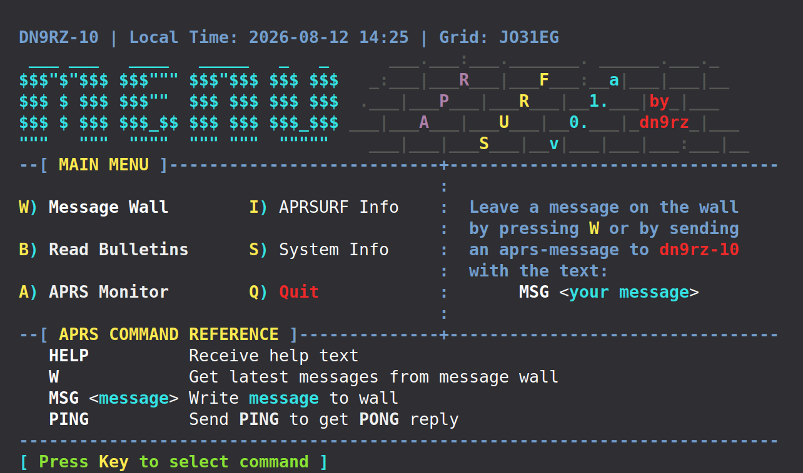
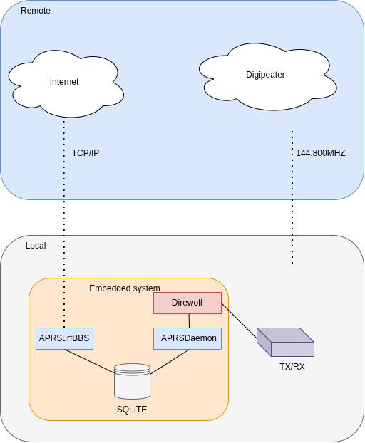

APRSurf
=======

APRSurf is a Ham-Radio BBS with APRS and Internet capabilities.

**Dependencies:**
- SQLite

**Build:**
- make help

**Installation & Configuration:**
TBD

**Architecture:**

Please note that this software is in early alpha stage! It might not work.
For what i know, it might make your computer explode.
But more often than not, it will behave like an APRS-BBS.
